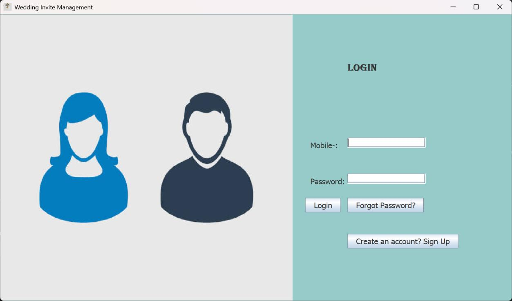
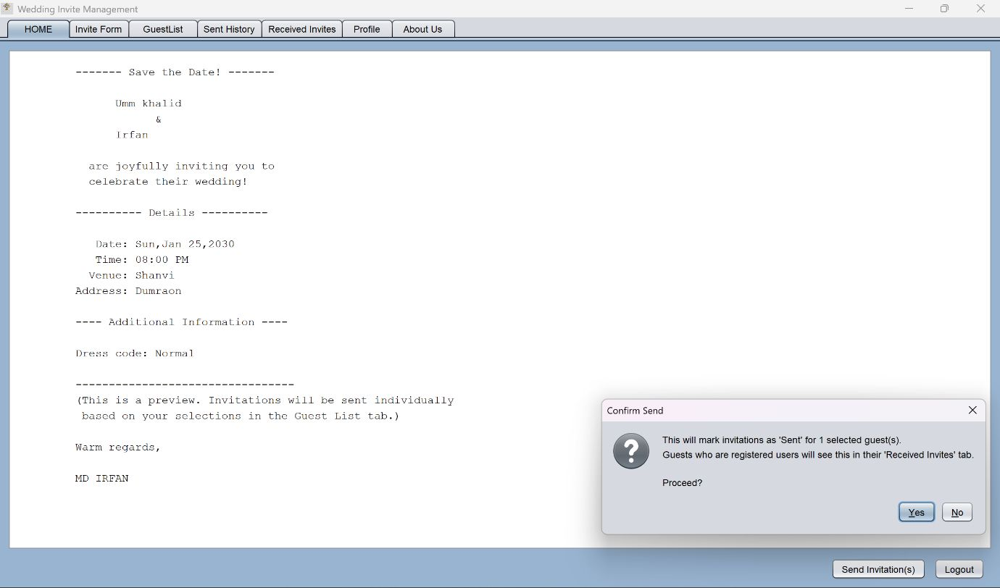

# Digital Wedding Invitation App

A desktop application built with Java Swing and JDBC to easily manage and send digital wedding invitations. The application allows you to manage guests, track invitation RSVPs, and create personalized wedding events.

> **Note**: This application was originally created as a monolithic application and was refactored into a clean Model-View-Controller (MVC) architecture for enhanced modularity and maintainability.

## ✨ Features
- **User Authentication**: Secure Sign-Up and Login features for hosts.
- **Invitation Creation**: Forms to specify bride, groom, venue, dates, and dress code.
- **Guest Management**: Add, update, delete, and view a tabular list of event guests. 
- **Send & Receive**: Built-in messaging system to send invitations directly from within the app and view an inbox of "Received" invitations.
- **Password Recovery**: Integrated security question functionality in case you forget your password.

## 🛠️ Technology Stack
- **Language:** Java (JDK 8+)
- **GUI Framework:** Java Swing, AWT
- **Database:** MySQL
- **Architecture:** MVC (Model-View-Controller)

## 👤 Author

**Irfan** 
- GitHub: [(https://github.com/irfan-8271)]
- LinkedIn: [(https://www.linkedin.com/in/md-irfan-6979303a6/)]

## 🚀 Getting Started

### Prerequisites
1. **Java Development Kit (JDK):** Make sure Java is installed and configured on your path.
2. **MySQL Server:** Ensure that you have a local instance running.
3. **Database Setup:** 
   Execute the included SQL schema to create the `wedding_invite_db` database and its tables (`users`, `guests`, `invitations`, `sent_invitations`, `received_invitations`).
4. **Driver:** Include the `mysql-connector-j-9.2.0.jar` driver in your project classpath.

### Running the Application Structure
1. Clone the repository.
2. Update the `DB_USER` and `DB_PASSWORD` variables inside `src/models/DatabaseConnection.java` to match your local MySQL configuration.
3. Compile the code:
   ```bash
   javac -cp ".;../lib/*" controllers/*.java models/*.java views/*.java views/tabs/*.java Main.java
   ```
4. Run the code:
   ```bash
   java -cp ".;../lib/*" Main
   ```

## 📸 Screenshots

 


## 🤝 Contributing
Contributions, issues, and feature requests are welcome! Feel free to check the issues page.
